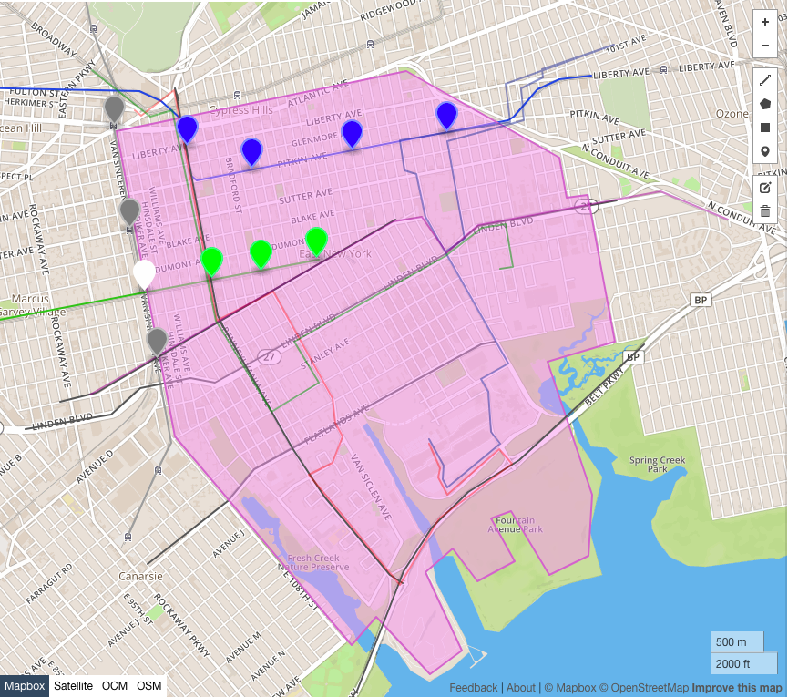
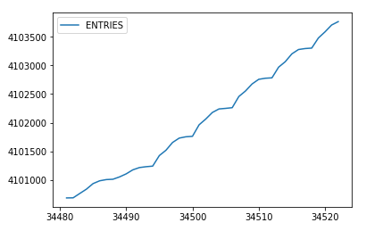
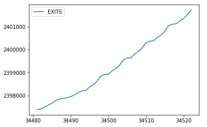

## Welcome to my website

### Name of neighborhood: East New York

### Demographics & Statistics:

#### Population by Sex
 
| Sex        | Percentage |
| ---------- |:----------:|
| Female     | 54.2       |
| Male       | 45.8       |

#### Population by Age Category
 
| Age Category| Percentage |
| ----------- |:----------:|
| Under 18    | 25.7       |
| 18 to 64    | 62.5       |
| 65 and over | 11.8       |

#### Population by Race & Ethnicity
 
|   Race   | Percentage |
| -------- |:----------:|
| White    | 5          |
| Black    | 52         |
| Native   | 0          |
| Asian    | 6          |
| Islander | 0          |
| Other    | 1          |
| Two+     | 1          |
| Hispanic | 35         |

Station Usage Statistics

